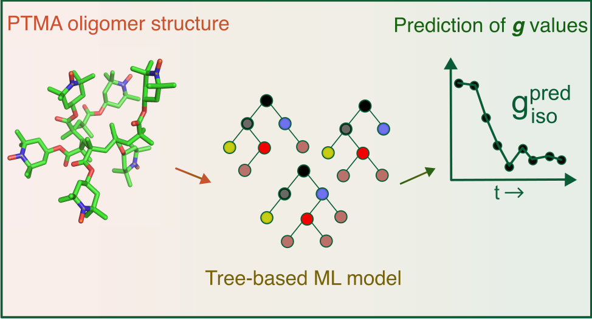

# Machine learning isotropic **_g_** values of radical polymers 

Davis Thomas Daniel1,2, Souvik Mitra3, Diddo Diddens5, Rüdiger A. Eichel1,4 and Josef Granwehr1,2

1. Institute of Energy and Climate Research (IEK-9), Forschungszentrum Jülich GmbH, Jülich, 52425, Germany
2. Institute of Technical and Macromolecular Chemistry, RWTH Aachen University, Aachen, 52056, Germany
3. Institute of Physical Chemistry, University of Münster, 48149, Münster, Germany
4. Institute of Physical Chemistry, RWTH Aachen University, Aachen 52056, Germany
5. Helmholtz-Institute Münster (IEK-12), Forschungszentrum Jülich GmbH, Jülich, Münster, 48149, Germany, 52425, Germany

This repository contains the relevant files and scripts to reproduce the results described in manuscript : [Machine learning isotropic **_g_** values of radical polymers](https://doi.org/10.1021/acs.jctc.3c01252). 

`Electron paramagnetic resonance measurements allow for obtaining experimental g values of radical polymers. Analogous to chemical shifts, g values give insight into the identity and environment of the paramagnetic center. In this work, machine learning based prediction of g values is explored as a viable alternative to density functional theory (DFT) methods. `

Files and folders :

**PTMA-ML.ipynb** : 

> Jupyter notebook detailing the workflow of generating the trained model. The file includes steps to load data sets, transform xyz files using molecular descriptors, optimise hyperparameters , train the model, cross validate using the training data set and evaluate the model.  A PDF version of the same jupyter notebook is also provided.

* **Datasets** : 

>  Contains PTMA polymer structures from TR,TE-1 and TE-2 data sets transformed using a molecular descriptor (SOAP,MBTR or DAD) and corresponding DFT-calculated g values. Structure data sets have 'structure_data' in the title, DFT calculated g values have 'giso_DFT_data' in the title. The files are in .npy (NumPy) format.

* **XYZ_files**:

> Contains atomic coordinates of PTMA structures in XYZ format. Two subfolders : WSD and TE-2 correspond to structures present in the whole structure data set and TE-2 test data set (see main text in the manuscript for details). Filenames in the folder 'XYZ_files/TE-2/PTMA-X/' are of the type 'chainlength_6ptma_Y'_Y''.xyz' where 'chainlength_6ptma' denotes the length of polymer chain (6 monomers), Y' denotes the proportion of monomers which are radicals (for instance, Y' = 50 means 3 out of 6 monomers are radicals) and Y'' denotes the order of the MD time frame. Actual time frame values of Y'' in ps is given in the manuscript.

* **Models** :

> Contains trained models , trained using MBTR, SOAP and DAD feature vectors and Extremely randomised trees (ERT) method.

* **Final_Model** :

> Contains the final ERT-MBTR model (see manuscript for details).

* **Scripts** :

> Contains scripts which can be used predict g values from XYZ files of PTMA structures with 6 monomer units and varying radical density. The scripts contain functions which transform the XYZ coordinates into an appropriate feature vector which the trained model uses to predict. The folder also contains additional files needed for the ERT-DAD model in .pkl format.

List of abbreviations :

* PTMA : poly(2,2,6,6-tetramethyl-1-piperidinyloxy-4-yl methacrylate)
* TR : Training data set
* TE-1 : Test data set 1
* TE-2 : Test data set 2
* ERT : Extremely randomized trees
* WSD : Whole structure data set
* SOAP : Smooth overlap of atomic orbitals
* MBTR : Many-body tensor representation
* DAD : Distances-Angles-Dihedrals

